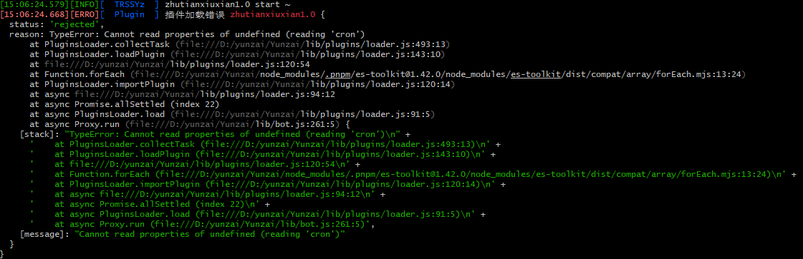
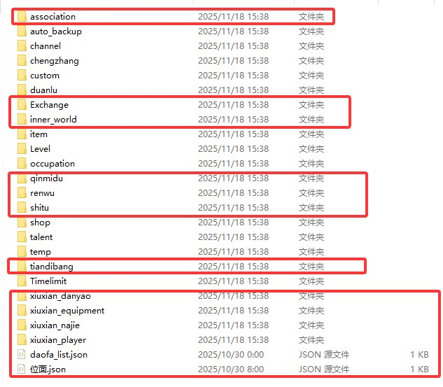
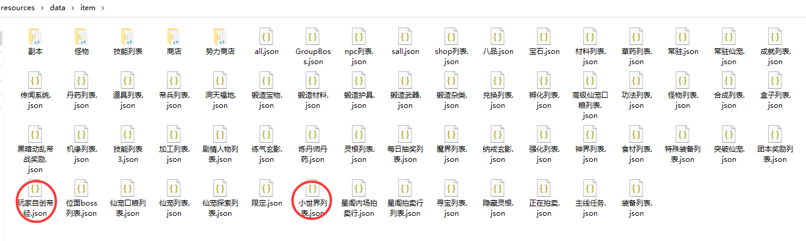

<div align="center">
<br>
<h1>诸天万界修仙V1.0「遮天三部曲」
</img>
</h1>
</br>
</div> 
       
## 安装      

> Miao-Yunzai/Yunzai-Bot/目录下执行  
```
git clone https://github.com/moxiaoyu1423/zhutianxiuxian.git ./plugins/zhutianxiuxian/


```   
## 安装依赖 

> Miao-Yunzai/Yunzai-Bot/目录下执行  
```
pnpm i    
```
## 小问题
如在运行该修仙插件时遇到以下报错不必惊慌，是我写的时候一个失误，不过此类报错不影响插件正常运行，如果有强迫症可以到云崽根目录的lib/plugins/loader.js中改动定时任务（大概在490行的样子）

```
  /** 收集定时任务 */
  collectTask(task, name) {
    if (!task) return // 如果 task 是 undefined 或 null，直接返回
    for (const i of Array.isArray(task) ? task : [task])
      if (i && i.cron && i.fnc) { // 添加对 i 的检查
        i.name ??= name
        this.task.push(i)
      }
  }
```
> [插件已适配频道和TRSS,推荐使用TRSS时雨崽搭配gocq插件以及频道插件使用](https://gitee.com/TimeRainStarSky/Yunzai)
## 转移存档            

   
存档位置  
```
\(Miao-Yunzai/Yunzai-Bot)\plugins\zhutianxiuxian\resources\data
\(Miao-Yunzai/Yunzai-Bot)\plugins\zhutianxiuxian\resources\data\item
```      
若要转移存档，将上面画框的文件保存，将修仙插件删除，执行上面安装命令，将上面画框的文件替换到对应文件,然后执行【#一键同步】 

## PS:该版本不稳定存在一定bug(绝对路径等)，如需更新请一定要备份好整个原版本，目测可移植原版的修仙插件，但是不保证
## 更新完后一定要发【#一键同步】，不要偷懒直接保存data文件夹
## 以下为基于原版修仙的魔改内容  
近期重大更新 (2025年10月)

系统完善：彻底完善元神、内景地、灵根进阶系统；新增仙古今世法、生命本源、道伤逻辑。

内容扩展：新增九天十地、下界八域位面及大量副本；更新仙古秘境（大型多人副本）废案。

玩法优化：优化道法赐福、位面传送阵；完善绝灵时代惩罚（物品消散、寿元压制）。

功能新增：新增成就、天骄、剧情人物系统；新增寻宝地图与泰拉瑞亚道具。

界面与自定义：新增多项图鉴系统；允许玩家上传并预览自定义练气皮肤,也能自选存档皮肤。

重要功能更新 (2025年7月 - 2025年9月)

战斗与成长：重写战斗系统，加入分身、控制等效果；增加圣体、命运神道体等成长路线。

世界与位面：增加位面系统、仙域与成仙路；完善破王成帝、仙帝权能及代价。

新玩法：增加小世界、证道成帝、自创功法帝经、传授功法、势力商店、垂钓众生等。

便捷优化：增加一键服用神药、突破、破体功能；优化副本沉迷逻辑，并且可以查看副本掉落物。

遮天元素深度融合：增加遮天位面副本、人体秘境体系、黑暗动乱事件及大量相关灵根功法。 
## 常见问题
>如出现msgTask报错mark错误则是因为一些未知原因无法发送zhutianxiuxian\resources\data\temp\temp.json的消息卡死，将该文件清空打入一个[]即可
## 交流/直接游玩      
- 官群：[QQ群链接跳转](https://qm.qq.com/q/nCqYx36uvC)     
## 配置与存档   
> zhutianxiuxian/ config / xiuxian / xiuxian.yaml       
> zhutianxiuxian/ resources / data          
>可根据需求自行修改     
## 免责声明       
1. 功能仅限内部交流与小范围使用       
2. 请勿用于任何以盈利为目的的场景      
## 原作者信息
原插件：[绝云间修仙V1.3.0](https://gitee.com/hutao222/DDZS-XIUXIAN-V1.3.0)  
原作者：[@DD斩首](https://gitee.com/hutao222)

赞助：
